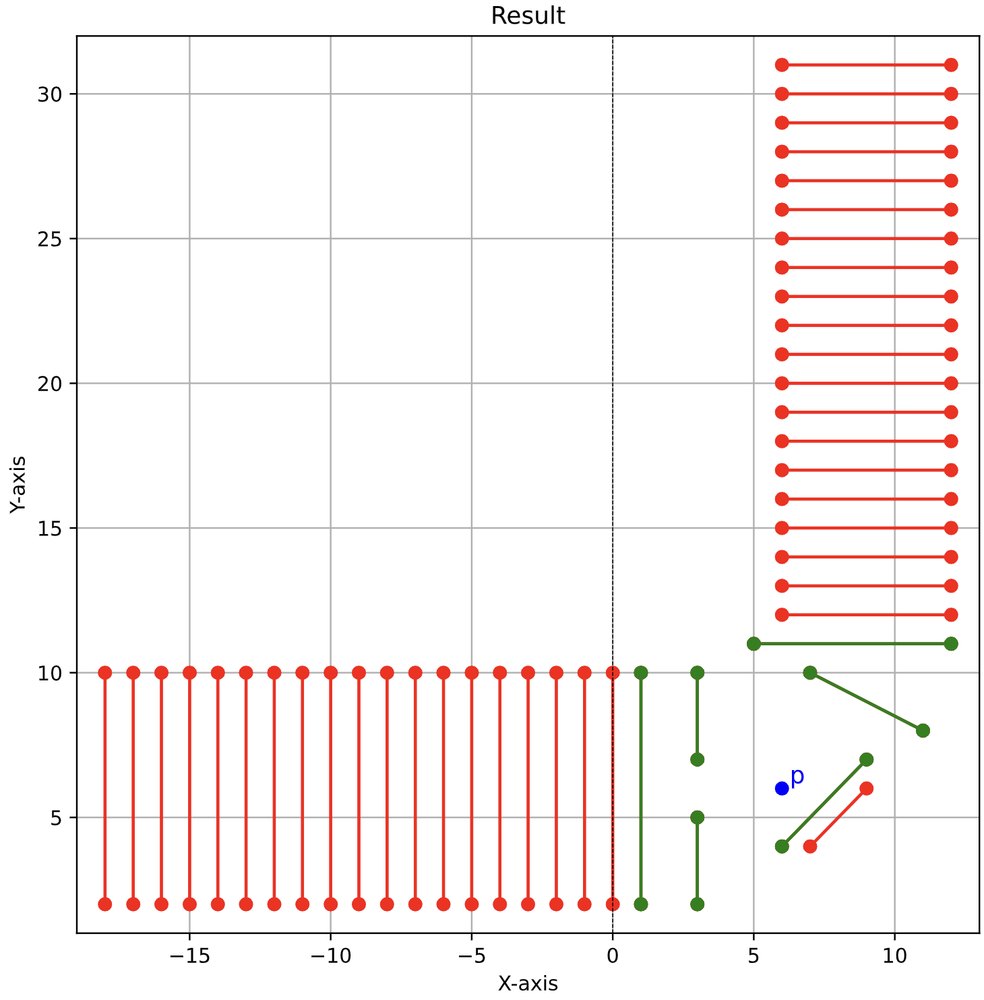
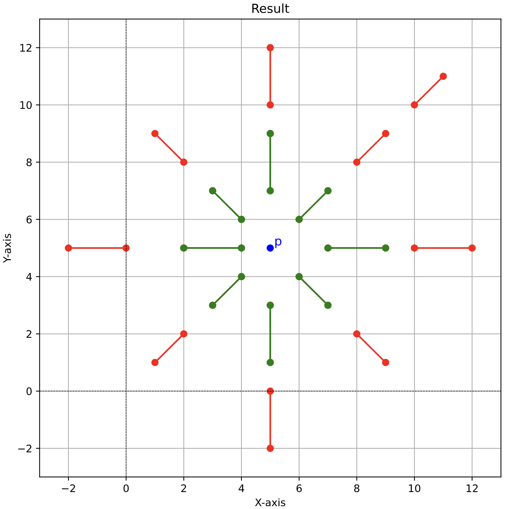

## First Project of the Course DM819 Computational Geometry

This project was developed together with my fellow student [@Caerullean](https://github.com/Caerullean).

The geometric problem we are solving in this project is problem 2.14 from our course textbook *Computational Geometry: Algorithms and Applications (3rd Edition)*. 

> [!Note]
> For a more detailed description of the project and code, I recommend reading the [rapport](./DM819__Part_1.pdf).


**Problem Description**:

Given a set of $n$ disjoint line segments in the plane and a fixed point $p$ (not lying on any segment), the goal is to determine which segments are visible from $p$. A segment is considered visible if there exists a point on it that can be connected to $p$ by a straight line that does not intersect any other segment. The task is to design an algorithm that solves this problem in $O(n \log n)$ time using a rotating half-line (**sweep-line**) approach pivoting around $p$.


Visual results from testing the algorithm on different input point configurations:
<p align="center">
  
  
</p>
The images above showcase the visible lines from the point $p$ for two different test cases. On the left is the result for a larger dataset (`data/big_test.txt`). On the right is the result for many colinear lines (`data/ManyCol.txt`). 
The green lines indicate visible lines from $p$, and the red lines indicate lines that are not visible from $p$.


> [!IMPORTANT]
> Please note that the git commit history might not fully reflect the individual contributions, as we pair programmed using the [VS Code Live Share extension](https://marketplace.visualstudio.com/items/?itemName=MS-vsliveshare.vsliveshare).


> **Citation:**  
> de Berg, M., Cheong, O., van Kreveld, M., & Overmars, M. (2008). *Computational Geometry: Algorithms and Applications* (3rd ed.). Springer.


---

## Manual
**Setup:**
After having cloned and possibly created and activated a virtual environment, install dependencies: 

```bash
pip install -r requirements.txt
```


The program expects input from a single `.txt` file containing:
*   **Exactly one Query Point:** Defined on its own line as `x y`.
*   **Any number of Line Segments:** Each defined on its own line as `x1 y1 x2 y2`.
*   The query point line can appear anywhere within the file.
*   The numbers on each line can be separated by any non-numeric characters (spaces, commas, brackets, etc.).
*   Each point or segment definition must end with a newline (`\n`).
*   Empty lines are ignored.

Example `data.txt`:
```txt
10 15 # Query Point p
5 5 20 5 # Segment 1
(25, 30) to {35}, [40] # Segment 2 (using odd delimiters)
5 25 20 25 # Segment 3
```

**Execution:**

The program requires the path to the input data file.

1.  **Provide the file path as a command-line argument:**
    ```bash
    python prog.py path/to/your/data.txt
    ```
    *(Replace `path/to/your/data.txt` with the actual path. This can be relative or absolute.)*

2.  **Run without arguments and enter the path when prompted:**
    ```bash
    python prog.py
    ```
    The program will then ask:
    ```
    File name: path/to/your/data.txt
    ```
    Enter the path and press Enter.

**Output:**

*   **Textual:** A list of the line segments visible from the query point is printed to the terminal (standard output), one segment per line in the format `x1 y1 x2 y2`.
*   **Visual:** A PDF file is generated ( named `result.pdf`) visualizing the results:
    *   **Green Lines:** Visible segments.
    *   **Red Lines:** Hidden segments.
    *   **Blue Dot ('p'):** The query point.


